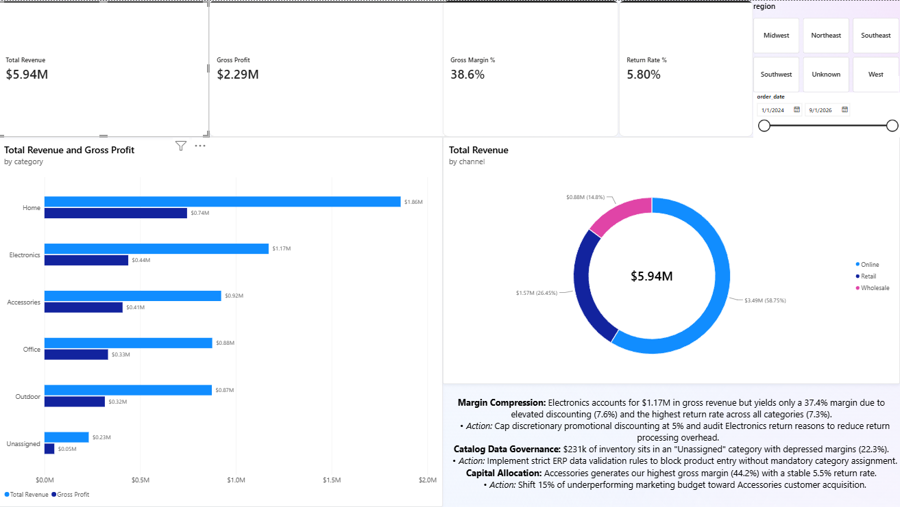
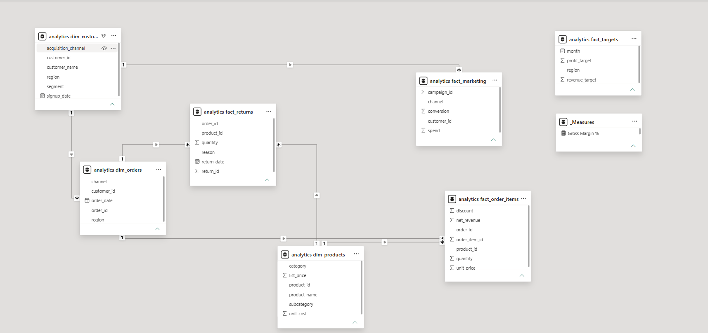

# 🏆 Northstar Commerce Executive BI Dashboard & Data Pipeline

An end-to-end data analytics and business intelligence platform built with **PostgreSQL**, **SQL Star Schema Dimensional Modeling**, and **Power BI Desktop**. This project transforms raw e-commerce transaction data into an interactive executive command center driving profitability, margin optimization, and regional performance tracking.



---

## 🎯 Business Context & Problem Statement

Northstar Commerce scaled to **$5.94M** in annual net revenue across 63,635 transactions, but executive leadership lacked visibility into underlying margin decay, return overhead, and regional quota variances. 

Key challenges addressed:
1. **Hidden Margin Leakage:** Discounting and return processing eroded gross margins in core revenue-generating product categories.
2. **Data Integrity Anomalies:** Raw staging datasets contained duplicate customer profiles, missing category metadata, inconsistent sales channel names, and negative transaction quantities.
3. **Unaligned Target Forecasting:** Operational regions consistently missed revenue targets by over 80% due to unrealistic static forecasting models.

---

## 🛠️ Data Pipeline Architecture

```
RAW E-COMMERCE CSVs
 (Customers, Orders, Items, Products, Returns, Targets)
         │
         ▼
POSTGRESQL STAGING TABLES (schema: public)
         │
         ▼
DATA AUDIT & ANOMALY DETECTION (SQL Diagnostics)
         │
         ▼
AUTOMATED SQL CLEANING PIPELINE (schema: analytics)
   ├── Window Functions (ROW_NUMBER for Deduplication)
   ├── Standardized Channel Synonyms (CASE / LOWER)
   └── Primary & Foreign Key Constraint Enforcement
         │
         ▼
ANALYTICAL STAR SCHEMA MODEL (Fact & Dim Tables)
         │
         ▼
PRODUCTION SQL VIEWS (vw_order_details & vw_monthly_performance)
         │
         ▼
POWER BI EXECUTIVE COMMAND CENTER (.pbix)
   ├── DAX Time-Intelligence & Margin Calculations
   └── Interactive Regional & Channel Drill-Downs
```

---

## 📊 Data Quality Audit & Cleaning Strategy

A SQL audit of the raw data revealed 4 major integrity issues:

* **Customer Duplicates:** 12 duplicate customer IDs (24 total records) resolved using `ROW_NUMBER() OVER (PARTITION BY customer_id ORDER BY signup_date DESC)`.
* **Missing Product Categories:** 4 products lacked category metadata, imputed as `'Unassigned'`.
* **Channel Inconsistency:** Values like `'ONLINE'`, `'online'`, and `'Web'` standardized to `'Online'`.
* **Corrupted Quantities:** Records with `quantity <= 0` filtered out of `analytics.fact_order_items`.

---

## 📐 Star Schema Data Model

The relational data model engineered in Power BI optimizes query speed and analytical granularity:



### Relationship Mapping:
* `fact_order_items` `(order_id)` ➔ `dim_orders` `(order_id)` `[* : 1]`
* `fact_order_items` `(product_id)` ➔ `dim_products` `(product_id)` `[* : 1]`
* `dim_orders` `(customer_id)` ➔ `dim_customers` `(customer_id)` `[* : 1]`
* `fact_returns` `(order_id)` ➔ `dim_orders` `(order_id)` `[* : 1]`
* `fact_returns` `(product_id)` ➔ `dim_products` `(product_id)` `[* : 1]`

---

## 📈 Key DAX Financial Measures

```dax
// Total Net Revenue
Total Revenue = SUM('analytics fact_order_items'[net_revenue])

// Total Cost of Goods Sold (COGS)
Total Cost = 
SUMX(
    'analytics fact_order_items',
    'analytics fact_order_items'[quantity] * RELATED('analytics dim_products'[unit_cost])
)

// Gross Profit
Gross Profit = [Total Revenue] - [Total Cost]

// Gross Profit Margin %
Gross Margin % = DIVIDE([Gross Profit], [Total Revenue], 0)

// Product Return Rate %
Return Rate % = 
DIVIDE(
    COUNT('analytics fact_returns'[return_id]),
    COUNT('analytics fact_order_items'[order_item_id]),
    0
)
```

---

## 💡 Key Analytical Findings & Executive Recommendations

1. **Cap Electronics Promotional Discounting:** Electronics represents **$1.17M** in gross revenue, but suffers from the highest average discount (**7.62%**) and highest return rate (**7.26%**).
   * *Recommendation:* Implement a 5% cap on discretionary sales discounts and audit Electronics supplier return defect rates.
2. **Resolve "Unassigned" Category Metadata Drag:** **$231k** in revenue resides in unassigned inventory with a **22.28%** gross margin (vs. 38.57% company average).
   * *Recommendation:* Require mandatory category taxonomy tags in ERP data entry forms.
3. **Reallocate Ad Spend to High-Margin Winner:** Accessories achieves the company's highest gross margin at **44.21%** with a low return rate (**5.55%**).
   * *Recommendation:* Shift 15% of underperforming marketing budget toward Accessories acquisition campaigns.

---

## 📂 Repository Structure

```
northstar_commerce/
├── README.md
├── sql/
│   ├── 01_raw_schema.sql
│   ├── 02_data_cleaning_pipeline.sql
│   └── 03_analytical_views.sql
├── dashboard/
│   ├── northstar_executive_command_center.pbix
│   └── screenshots/
│       ├── executive_overview.png
│       └── data_model_star_schema.png
└── docs/
    └── DATA_AUDIT_REPORT.md
```
